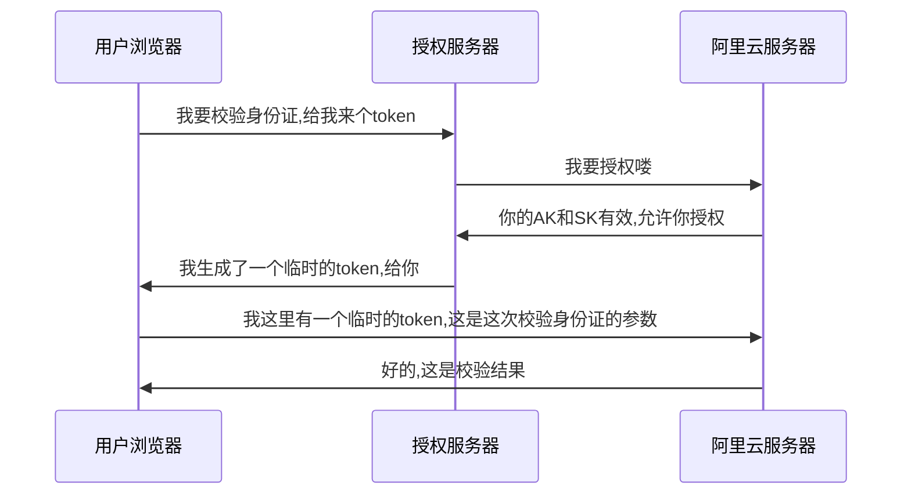

<div align="center">
    <h1>
        西工大拼车系统_内部说明
    </h1>
    <h3>
        王旻安 2023.4.11
    </h3>
</div>


## 0. **非常重要**—Key管理

所有AK,SK,密码均不允许明文出现在代码和配置文件中。

RSA加密中前端不允许出现公钥。

能使用临时token请全部使用临时token，如果程序运行确有需要使用，有关AK，SK与密码均应写入nacos注册中心的配置文件中。


## 1. Record类

record是Java14出现的一个特性(毕竟14已经这么多年了所以我们不管他叫新特性)

```java
public record EmployeeRecord(Long id, 
		String firstName, 
		String lastName, 
		String email, 
		int age) {
	
}

public class RecordExample {
	public static void main(String[] args) 
	{
		EmployeeRecord e1 = new EmployeeRecord
				(1l, "Lokesh", "Gupta", "howtodoinjava@gmail.com", 38);
		
		System.out.println(e1.id());
		System.out.println(e1.email());
		
		System.out.println(e1);
	}
}
```

需要了解更多可以访问[Record类型介绍 ](https://zhuanlan.zhihu.com/p/372678867)

我希望本次实验中的DTO部分可以多使用该特性来减少冗余代码(当然我知道lombok有时候确实显得方便得多而且灵活)


## 2. 跨域问题

vue的proxy解决跨域问题给我一种很捉摸不定的感觉。所有跨域问题都由后端实现。


## 3. 包名

后端各模块包名应统一命名为edu.npu


## 4. Json解析

我打算转jackson了。

基础的转换如下所示

```java
ObjectMapper mapper = new ObjectMapper(); 
// java对象转换为json字符换
String Json =  mapper.writeValueAsString(student1); 
// json字符串转换为java对象
Student student2 = mapper.readValue(Json, Student.class);
```

jackson-core - 基于流解析Json，就是从流中读取，生成事件，类似xml的sax。核心类是JsonGenerator和JsonParser。
jackson-annotation - 提供了注解
jackson-databind - 对jackson-core进行封装，可以实现Json和Pojo转换、Json和JsonTree(类似dom树)转换。核心类是ObjectMapper、JsonNode

配置类如下

```java
@Configuration
public class JacksonConfig {

    @Bean
    @Primary
    @ConditionalOnMissingBean(ObjectMapper.class)
    public ObjectMapper jacksonObjectMapper(Jackson2ObjectMapperBuilder builder) {
        ObjectMapper objectMapper = builder.createXmlMapper(false).build();

        // 通过该方法对mapper对象进行设置，所有序列化的对象都将按改规则进行系列化
        // Include.Include.ALWAYS 默认
        // Include.NON_DEFAULT 属性为默认值不序列化
        // Include.NON_EMPTY 属性为 空（""） 或者为 NULL 都不序列化，则返回的json是没有这个字段的。这样对移动端会更省流量
        // Include.NON_NULL 属性为NULL 不序列化
//        objectMapper.setSerializationInclusion(JsonInclude.Include.NON_EMPTY);
//        objectMapper.configure(DeserializationFeature.FAIL_ON_UNKNOWN_PROPERTIES, false);
//        // 允许出现特殊字符和转义符
//        objectMapper.configure(JsonParser.Feature.ALLOW_UNQUOTED_CONTROL_CHARS, true);
//        // 允许出现单引号
//        objectMapper.configure(JsonParser.Feature.ALLOW_SINGLE_QUOTES, true);

        DeserializationConfig cfg = objectMapper.getDeserializationConfig();
        //设置JSON时间格式  
        SimpleDateFormat myDateFormat = new SimpleDateFormat("yyyy-MM-dd HH:mm:ss"); 

        cfg.setDateFormat(myDateFormat); 
        
        objectMapper.getSerializerProvider().setNullValueSerializer(new JsonSerializer<Object>() {
            @Override
            public void serialize(Object o, JsonGenerator jsonGenerator, SerializerProvider serializerProvider) throws IOException {
                jsonGenerator.writeString("");
            }
        });
        return objectMapper;
    }

    // 配置特性属性值
    @Bean
    JacksonProperties jacksonProperties() {
        JacksonProperties properties = new JacksonProperties();
        properties.setDateFormat(DateHandler.DATETIME_PATTERN);
        properties.setJodaDateTimeFormat(DateHandler.DATETIME_PATTERN);
        properties.setTimeZone(TimeZone.getTimeZone(DateHandler.ZONEID));
        properties.getSerialization().put(SerializationFeature.WRITE_DATES_AS_TIMESTAMPS, false);
        return properties;
    }

    /**
     * Jackson全局转化long类型为String，解决jackson序列化时long类型缺失精度问题
     * @return Jackson2ObjectMapperBuilderCustomizer 注入的对象
     */
    @Bean
    public Jackson2ObjectMapperBuilderCustomizer jackson2ObjectMapperBuilderCustomizer() {
        Jackson2ObjectMapperBuilderCustomizer cunstomizer = new Jackson2ObjectMapperBuilderCustomizer() {
            @Override
            public void customize(Jackson2ObjectMapperBuilder jacksonObjectMapperBuilder) {
                jacksonObjectMapperBuilder.serializerByType(Long.TYPE, ToStringSerializer.instance);
                jacksonObjectMapperBuilder.serializerByType(Long.class, ToStringSerializer.instance);

            }
        };
        return cunstomizer;
    }

}
```

话说回来，咱就掰扯掰扯fastjson快不快吧！


## 5. 返回类型

~~我们这次不定义返回类型，使用标准HTTP_STATUS_CODE和ResponseEntity~~

当我没说。HttpStatus还是很弱诶。自定义返回类型其实也是有历史渊源的，可以追溯到运营商干坏事的年代。


## 6. 使用到的外部资源

+ 最终部署平台：华为云ArmECS-docker

+ nacos注册中心-开发环境dev：杭州阿里云ECS 121.41.227.153:8848/nacos --> 已经重定向解析到nacos.wangminan.me/nacos
+ nacos注册中心-生产环境prod：华为云ArmECS-60.204.153.158:8848/nacos
+ MySQL数据库：杭州阿里云RDS mysql.wangminan.me
+ ElasticSearch，Minio，xxl-job：香港阿里云SWAS 8.218.84.229
+ OSS对象存储：香港阿里云OSS wangminan-files.oss-cn-hongkong.aliyuncs.com
+ 短信服务：杭州阿里云短信 dysmsapi.aliyuncs.com
+ STS授权服务： [见第八条](#8. STS授权)
+ Redis数据库：为了避免出现`远程主机强制关闭了一个现有的连接`错误，我们使用本机redis。请访问华为云ECS60.204.153.158的6379端口，密码同root登录密码。


## 7. Redis的Key值命名

推荐的Redis可视化管理工具为RESP

为了更好的区分Redis键的层级关系，请使用`:`来对键名进行分隔

键名必须由至少两部分组成，第一部分必须为类型，例如`token`用于记录token，`prize`用于记录奖项，动态部分应处于后面的位置


## 8. STS授权

我们本次项目中文件上传OSS与用户身份证输入OCR，用户驾驶证输入OCR的token获取都走STS临时授权

+ OSS https://sts.wangminan.me/oss

  轮子在management_client中已跑通

+ OCR https://sts.wangminan.me/ocr

  Java版本轮子已跑通



返回示例如下所示

```json
{
    AccessKeyId: "STS.NV6Vo8K532ts93jmh8skxSYVs",
    AccessKeySecret: "2dMBAVrHtEsVxrmJtfdjGTjXaoV8zdiF3cUz8hkEHiVR",
    SecurityToken: "CAIS9AF1q6Ft5B2yfSjIr5WDHdWMpuoShbaYOxXbiWhtf+RUvJz9kTz2IHFNeXlvBesbs/4/nm9R5vcZlqJoRoReREvCccZr8sy5NqBJ89KT1fau5Jko1beHewHKeTOZsebWZ+LmNqC/Ht6md1HDkAJq3LL+bk/Mdle5MJqP+/UFB5ZtKWveVzddA8pMLQZPsdITMWCrVcygKRn3mGHdfiEK00he8ToguPnnnpLFtkCO1g2ilrIvyt6vcsT+Xa5FJ4xiVtq55utye5fa3TRYgxowr/Yv0fwbpWya44vNWQYIs0TdKYjO+9hoJxVla7MmC0v8ckpLbw0TGoABdeTViI/MPsGbe+8a/IQuG5go7c1Cdba8Nwr+RUq6wJpFDGeoRpjjS/jQj5zWoyhGiScUoZWOEyUWtNjlecewhtrW/1ZLlHGCVbPOc21ASucp17kAoICcD3MrTwmk3ZNdlYUg8darbQjqeoqSxZzuCsAH+lK8qkk+/OctGwfKBAI=",
    Expiration: "2023-04-14T14:02:11Z"
}
```

