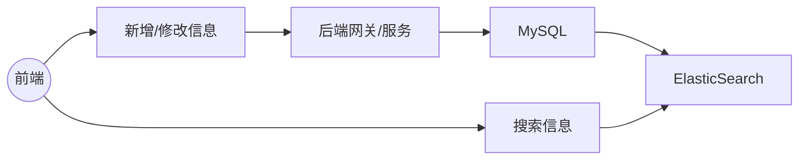

<div align="center">
    <h1>
        项目经验(?)
    </h1>
</div>


这个项目之所以后端坚持上分布式与微服务就是希望能够通过亲自上手的方式来加强记忆，同时提升熟练度。很多坑不自己踩过是永远不会了解的。这篇文档存在的意义就是记录一下遇到的一些问题、


## 1. 长事务

周二的时候做到了拼车行程搜索模块，很熟悉的架构



在这层MySQL和ElasticSearch之间就存在着分布式事务的问题。将这整个流程直接写在一个方法线程中显然是不可取的。整个事务会显得非常冗长，前端用户的体验极差。

解决的方法有两种：

+ 我的歪门邪道是因为确实只有两个任务需要同时进行，因此可以同时开两个线程来执行两地的任务。为了保证新开线程的事务一致性，可以另起一个`@Service`，也可以使用获取回调并手动提交的方式。

+ 学成在线中对类似情况的解决方案

  详见学成在线第4章讲义

  


## 2. 多线程事务

回到事务的核心概念上来，事务具有ACID属性

+ 原子性（Atomicity）
  原子性是指事务包含的所有操作要么全部成功，要么全部失败回滚，
+ 一致性（Consistency）
  一致性是指事务必须使数据库从一个一致性状态变换到另一个一致性状态，也就是说一个事务执行之前和执行之后都必须处于一致性状态。
+ 隔离性（Isolation）
  隔离性是当多个用户并发访问数据库时，比如操作同一张表时，数据库为每一个用户开启的事务，不能被其他事务的操作所干扰，多个并发事务之间要相互隔离。
+ 持久性（Durability）
  持久性是指一个事务一旦被提交了，那么对数据库中的数据的改变就是永久性的，即便是在数据库系统遇到故障的情况下也不会丢失提交事务的操作。

首先应当指出的常见知识空缺如下:

+ **ElasticSearch不支持事务**，我们从底层来说，那就是基于Segment的Lucene的单一translog和MySQL的三log不同，而在InnoDB事务中起关键作用的就是undolog和redolog，ES显然缺乏这样的机制。

  有关三大日志，尤其是undolog，请看[MySQL三大日志(binlog、redo log和undo log)详解 | JavaGuide(Java面试 + 学习指南)](https://javaguide.cn/database/mysql/mysql-logs.html#undo-log)

  因此我们主要采用的解决方案如下

  

+ **Redis的事务不具备ACID属性**。Redis中的事务是一种将多个命令打包成一个原子性操作，并确保该操作在执行过程中不会被其他客户端或线程中断的机制。具体涉及到RDB,AOF与混合持久化机制并没有提供事务操作。[Redis持久化机制详解 | JavaGuide(Java面试 + 学习指南)](https://javaguide.cn/database/Redis/Redis-persistence.html)

所以我们在上一个长事务案例中把MySQL与Redis+ES操作分离在两个线程上，MySQL操作位于主线程且开启注解型事务的方式属于歪打正着。确实只有MySQL需要进行事务管理，**新开线程中的操作不需要被事务管理**。而且在新线程上执行事务管理意味着我们需要等待新线程返回后才能最终将结果返回给用户，这样的做法就违背了我们为了快速返回结果而使用多线程操作的初衷了。

但是话说回来，如果两个线程上确实需要同步执行事务管理时又应当如何解决呢？

面对多线程事务肯定不能再用注解式事务来处理了，AOP已经解决不了问题了。我觉得不用多说什么原理上的内容了，主要是通过`countDownLatch`配合实现的


> 再以 `CountDownLatch` 以例，任务分为 N 个子线程去执行，`state` 也初始化为 N（注意 N 要与线程个数一致）。这 N 个子线程是并行执行的，每个子线程执行完后`countDown()` 一次，state 会 CAS(Compare and Swap) 减 1。等到所有子线程都执行完后(即 `state=0` )，会 `unpark()` 主调用线程，然后主调用线程就会从 `await()` 函数返回，继续后余动作。

以下是一个向数据库更新教师信息的方法，由于采用了**在一堆update之后手动提交**，避免了每一次update就提交事务(框架隐藏性事务)，因此在海量数据下能极大提高写入性能。缺点是一旦出现问题后所有操作都回滚。

```java
@Service
public class StudentServiceImpl implements StudentService {
    @Autowired
    private StudentMapper studentMapper;

    @Autowired
    private DataSourceTransactionManager dataSourceTransactionManager;

    @Autowired
    private TransactionDefinition transactionDefinition;

    @Override
    public void updateStudents(List<Student> students, CountDownLatch threadLatch) {
        TransactionStatus transactionStatus = dataSourceTransactionManager.getTransaction(transactionDefinition);
        System.out.println("子线程：" + Thread.currentThread().getName());
        try {
            students.forEach(s -> {
                // 更新教师信息
                // String teacher = s.getTeacher();
                String newTeacher = "TNO_" + new Random().nextInt(100);
                s.setTeacher(newTeacher);
                studentMapper.update(s);
            });
            dataSourceTransactionManager.commit(transactionStatus);
            threadLatch.countDown();
        } catch (Throwable e) {
            e.printStackTrace();
            dataSourceTransactionManager.rollback(transactionStatus);
        }
    }
}
```

我们可以看到在完成了一次批处理后`CountDownLatch`下降1

创建线程池并在多线程中调用`updateStudents`的代码如下

```java
@Autowired
private DataSourceTransactionManager dataSourceTransactionManager;

@Autowired
private TransactionDefinition transactionDefinition;

@Autowired
private StudentService studentService;

/**
 * 对用户而言，27s 任是一个较长的时间，我们尝试用多线程的方式来经行修改操作看能否加快处理速度
 * 预计创建10个线程，每个线程进行5000条数据修改操作
 * 耗时统计
 * 1 线程数：1      耗时：25s
 * 2 线程数：2      耗时：14s
 * 3 线程数：5      耗时：15s
 * 4 线程数：10     耗时：15s
 * 5 线程数：100    耗时：15s
 * 6 线程数：200    耗时：15s
 * 7 线程数：500    耗时：17s
 * 8 线程数：1000    耗时：19s
 * 8 线程数：2000    耗时：23s
 * 8 线程数：5000    耗时：29s
 */
@Test
void updateStudentWithThreads() {
    //查询总数据
    List<Student> allStudents = studentMapper.getAll();
    // 线程数量
    final Integer threadCount = 100;

    //每个线程处理的数据量
    final Integer dataPartionLength = (allStudents.size() + threadCount - 1) / threadCount;

    // 创建多线程处理任务
    ExecutorService studentThreadPool = Executors.newFixedThreadPool(threadCount);
    CountDownLatch threadLatchs = new CountDownLatch(threadCount);

    for (int i = 0; i < threadCount; i++) {
        // 每个线程处理的数据
        List<Student> threadDatas = allStudents.stream()
                .skip(i * dataPartionLength).limit(dataPartionLength).collect(Collectors.toList());
        studentThreadPool.execute(() -> {
            studentService.updateStudents(threadDatas, threadLatchs);
        });
    }
    try {
        // 倒计时锁设置超时时间 30s
        threadLatchs.await(30, TimeUnit.SECONDS);
    } catch (Throwable e) {
        e.printStackTrace();
    }

    System.out.println("主线程完成");
}
```

这样就完成了基础的多线程事务。

对上述代码当然还可以做进一步优化，具体是参考这篇[面试官：Java 多线程怎么做事务控制？一半人答不上来。。-腾讯云开发者社区-腾讯云 (tencent.com)](https://cloud.tencent.com/developer/article/2057510) 写得还不错。


## 3. 分布式事务

详见黑马微服务课程高级篇Seata的部分。详细讲述了ACP原则与Seata的四种模式

人家已经写好轮子了我们就不造轮子了。


## 4. Jackson序列化Object异常

Jackson在执行`objectMapper.convertValue`操作时报出Cannot construct instance of (although at least one Creator exists)异常

需要为被其转换的类加上如下构造

```java
public LoginAccount(String json) throws IOException {
        LoginAccount loginAccount = new ObjectMapper().readValue(json, LoginAccount.class);
        this.id = loginAccount.getId();
        this.username = loginAccount.getUsername();
        this.password = loginAccount.getPassword();
        this.role = loginAccount.getRole();
        this.isDeleted = loginAccount.getIsDeleted();
}
```

或者 使用 `ObjectMapper.readValue()` 代替 `ObjectMapper.convertValue()` 对JSON数据进行反转

这两个方法的主要区别在于，`readValue`方法需要将JSON字符串作为参数传递，而`convertValue`方法需要将JSON对象作为参数传递。此外，`readValue`方法可以将JSON字符串转换为Java对象的任何类型，而`convertValue`方法只能将JSON对象转换为指定类型的Java对象。

在类出现继承关系时请及时注意框定需要转换的字段范围。需要将父类的字段标记为已排除字段，避免出现构造方法的引用问题。

最终的`LoginAccount`类如下所示

```java
package edu.npu.entity;

import com.fasterxml.jackson.annotation.JsonIgnoreProperties;
import com.fasterxml.jackson.annotation.JsonInclude;
import com.fasterxml.jackson.databind.ObjectMapper;
import edu.npu.common.RoleEnum;
import lombok.AllArgsConstructor;
import lombok.Data;
import lombok.NoArgsConstructor;
import org.springframework.security.core.GrantedAuthority;
import org.springframework.security.core.authority.SimpleGrantedAuthority;
import org.springframework.security.core.userdetails.UserDetails;

import java.io.IOException;
import java.io.Serial;
import java.io.Serializable;
import java.util.Collection;
import java.util.List;
import java.util.Objects;

/**
 * 用于用户名密码登录所需表格
 */
@Data
@NoArgsConstructor
@AllArgsConstructor
// 排除UserDetails的参数。这些参数不需要被存到Redis中，可以直接通过本类中方法生成
@JsonIgnoreProperties(
        value = {"accountNonExpired", "accountNonLocked",
                "credentialsNonExpired", "enabled", "authorities"})
@JsonInclude(JsonInclude.Include.NON_NULL)
public class LoginAccount implements Serializable, UserDetails {
    /**
     * 用户登录时唯一编号
     */
    private Long id;

    /**
     * 用户登录名/用户手机号
     */
    private String username;

    /**
     * 用户登录密码
     */
    private String password;

    /**
     * 用户角色:司机/乘客,管理员
     */
    private int role;

    /**
     * 逻辑删除字段,0未删除,1已删除
     */
    private Integer isDeleted;

    @Serial
    private static final long serialVersionUID = 184688L;

    @Override
    public Collection<? extends GrantedAuthority> getAuthorities() {
        return List.of(new SimpleGrantedAuthority(
                Objects.requireNonNull(RoleEnum.fromValue(role)).name()));
    }

    @Override
    public boolean isAccountNonExpired() {
        return true;
    }

    @Override
    public boolean isAccountNonLocked() {
        return isDeleted == 0;
    }

    @Override
    public boolean isCredentialsNonExpired() {
        return true;
    }

    @Override
    public boolean isEnabled() {
        return true;
    }

    // 需要手动准备如下构造函数供Jackson调用 否则报Cannot construct instance of
    public LoginAccount(String json) throws IOException{
        LoginAccount loginAccount = new ObjectMapper().readValue(json, LoginAccount.class);
        this.id = loginAccount.getId();
        this.username = loginAccount.getUsername();
        this.password = loginAccount.getPassword();
        this.role = loginAccount.getRole();
        this.isDeleted = loginAccount.getIsDeleted();
    }
}
```


## 5. 价格计算

这次项目中的价格部分确实是进行了简化的。

关于存价格这件事一般有俩解决方案

+ 所有价格都用int存，表示分位，计算时也按照分的逻辑进行运算，如果实在需要按照元的情况进行计算了(如向支付宝发送请求时)再进行转换。我个人认为这种方案是稳妥的，能够规避大量的精度问题。
+ 使用decimal，包括在Java端使用`BigDecimal`，在MySQL端`decimal`类型来存储价格数据。能尽量从数据类型的角度上来规避精度丢失问题。


## 6. Redis哨兵集群

我的Redis满打满算只有三台，跑不起来多主多从的cluster。勉强跑一个sentinel来给这个项目助助兴。

基于[基于 Docker 的 Redis 高可用集群搭建](https://zhuanlan.zhihu.com/p/70592387)与[黑马程序员微服务课程高级篇Redis讲](https://www.bilibili.com/video/BV1LQ4y127n4/)，本项目主要为了实验搭建的Redis集群。

集群拓扑如下所示


当前的主节点为华为云ECS服务器。负责所有数据写入工作。

使用`info`命令查看节点信息可得

```properties
# Replication
role:master
connected_slaves:2
slave0:ip=121.41.227.153,port=6379,state=online,offset=3161003,lag=0
slave1:ip=8.218.84.229,port=6379,state=online,offset=3161003,lag=0
master_failover_state:no-failover
master_replid:e40d5214d82edaf1b2255ca3e3960bdaaf80867a
master_replid2:0000000000000000000000000000000000000000
master_repl_offset:3161142
second_repl_offset:-1
repl_backlog_active:1
repl_backlog_size:1048576
repl_backlog_first_byte_offset:2112567
repl_backlog_histlen:1048576
```

了解到其余两个节点都是从节点

当Redis服务器的主节点华为云ECS主观失能时(大于等于$[3/2] + 1 = 1 + 1 = 2$个sentinel节点与未获取到master心跳时)，sentinel将根据权重自动选择可用的slave节点，作为新的master，同时通知原本的master已产生新的主节点。

与分片模式不同，该集群中每个节点都拥有相同的数据(基于操作流同步实现)。

在使用`spring-boot-starter-data-Redis`连接集群时，我大概踩了一万个坑。最终试验后得出在`SpringBoot3.1`的情况下应该做的工作如下列举。

+ 使用maven引入依赖。坐标为

  ```xml
  <dependency>
          <groupId>org.springframework.boot</groupId>
          <artifactId>spring-boot-starter-data-Redis</artifactId>
  </dependency>
  ```

+ 写配置文件。关于lettuce连接池的调优本文不涉及，请另行查看资料

  ```yaml
  spring:
    data:
      Redis:
        lettuce:
          pool:
            max-active: 8
            max-idle: 8
            max-wait: -1ms
            min-idle: 0
        sentinel:
          password: npu2020302598
          master: mymaster
          nodes:
            - 60.204.153.158:27001
            - 60.204.153.158:27002
            - 60.204.153.158:27003
        database: 0
        timeout: 6000ms
        password: npu2020302598
  ```

  注意：下列条件不满足时Redis连接失败

  + sentinel节点若有密码应当保持一致，在`spring.data.Redis.sentinel.password`中给出
  + Redis服务器节点若有密码也应保持一致，需要在`spring.data.Redis.password`中给出
  + 请不要随便改动上述配置的顺序。这是个很玄学的问题，但就是这样。顺序变动后可能会出现连接问题。

+ 写配置类。我们希望slave节点负责主要的读工作，而master节点负责所有的写工作，则配置类如下

  ```java
  package edu.npu.config;
  
  import io.lettuce.core.ReadFrom;
  import org.springframework.boot.autoconfigure.data.Redis.LettuceClientConfigurationBuilderCustomizer;
  import org.springframework.context.annotation.Bean;
  import org.springframework.context.annotation.Configuration;
  
  /**
   * @author : [wangminan]
   * @description : [Redis配置类]
   */
  @Configuration
  public class RedisConfig {
      @Bean
      public LettuceClientConfigurationBuilderCustomizer customizer() {
          return clientConfigurationBuilder -> clientConfigurationBuilder
                  // 优先读slave 所有slave节点都不可用才读master
                  .readFrom(ReadFrom.REPLICA_PREFERRED);
      }
  }
  ```

  其中，`ReadFrom`是一个枚举类。

  ```java
  /**
   * Setting to read from the upstream only.
   */
  public static final ReadFrom MASTER = new ReadFromImpl.ReadFromUpstream();
  
  /**
   * Setting to read preferred from the upstream and fall back to a replica if the master is not available.
   */
  public static final ReadFrom MASTER_PREFERRED = new ReadFromImpl.ReadFromUpstreamPreferred();
  
  /**
   * Setting to read from the upstream only.
   *
   * @since 6.0
   */
  public static final ReadFrom UPSTREAM = new ReadFromImpl.ReadFromUpstream();
  
  /**
   * Setting to read preferred from the upstream and fall back to a replica if the upstream is not available.
   *
   * @since 6.0
   */
  public static final ReadFrom UPSTREAM_PREFERRED = new ReadFromImpl.ReadFromUpstreamPreferred();
  
  /**
   * Setting to read preferred from replica and fall back to upstream if no replica is available.
   *
   * @since 5.2
   */
  public static final ReadFrom REPLICA_PREFERRED = new ReadFromImpl.ReadFromReplicaPreferred();
  
  /**
   * Setting to read preferred from replicas and fall back to upstream if no replica is available.
   *
   * @since 4.4
   * @deprecated Renamed to {@link #REPLICA_PREFERRED}.
   */
  @Deprecated
  public static final ReadFrom SLAVE_PREFERRED = REPLICA_PREFERRED;
  
  /**
   * Setting to read from the replica only.
   *
   * @since 5.2
   */
  public static final ReadFrom REPLICA = new ReadFromImpl.ReadFromReplica();
  
  /**
   * Setting to read from the replica only.
   *
   * @deprecated renamed to {@link #REPLICA}.
   */
  @Deprecated
  public static final ReadFrom SLAVE = REPLICA;
  
  /**
   * Setting to read from the node with the lowest latency during topology discovery. Note that latency measurements are
   * momentary snapshots that can change in rapid succession. Requires dynamic refresh sources to obtain topologies and
   * latencies from all nodes in the cluster.
   *
   * @since 6.1.7
   */
  public static final ReadFrom LOWEST_LATENCY = new ReadFromImpl.ReadFromLowestCommandLatency();
  
  /**
   * Setting to read from the node with the lowest latency during topology discovery. Note that latency measurements are
   * momentary snapshots that can change in rapid succession. Requires dynamic refresh sources to obtain topologies and
   * latencies from all nodes in the cluster.
   *
   * @deprecated since 6.1.7 as we're renaming this setting to {@link #LOWEST_LATENCY} for more clarity what this setting
   *             actually represents.
   */
  @Deprecated
  public static final ReadFrom NEAREST = LOWEST_LATENCY;
  
  /**
   * Setting to read from any node.
   *
   * @since 5.2
   */
  public static final ReadFrom ANY = new ReadFromImpl.ReadFromAnyNode();
  
  /**
   * Setting to read from any replica node.
   *
   * @since 6.0.1
   */
  public static final ReadFrom ANY_REPLICA = new ReadFromImpl.ReadFromAnyReplica();
  ```

  由此可见我们如果希望使用延迟最低的情况也可以使用`LOWEST_LATENCY`


## 7. 记2023.6.30的宕机事故

### 7.1 宕机

2023.6.30下午，为演示项目，我打开了拼车系统客户端并尝试进行登录，但登录多次异常。我以为只是本来只是I/O问题，但出现了经由gateway与auth服务进入客户端后，其他服务的security-sdk报4012无token的问题。我们显然已经做过登录了，浏览器显示token存储正常，因此我判断是后端问题并尝试做紧急修复。

### 7.2 查询原因

我打开IDEA，查看docker-compose的执行日志，发现报4012的服务存在连接Redis超时或发现Redis中没有auth对应token问题，同时伴随大量到nacos的重连重试日志，体现为nacos的RPC端口9848频繁断开重连。

因此先通过RESP查看Redis集群内键值对的保存情况，发现上海华为云主节点与sentinel集群内数据正常，但上海主节点与杭州、香港从节点间存在数据同步异常问题，因此使用

```redis
info replication
```

命令查看集群主从情况，发现原本的上海主节点已经丢失master身份，成为slave节点，指向主节点香港SWAS服务器，但香港SWAS的Redis显示从节点连接全失败。包括杭州节点与香港节点之间已失去连接。

### 7.3 尝试恢复Redis集群

由于sentinel节点需要在docker重启后进入容器启动，因此我暂时没有动在上海节点上的伪分布式Redis-sentinel集群。只是尝试通过重启三个Redis节点的方式重新建立主从关系。

很不幸，Redis集群重启失败了，杭州ECS与香港SWAS的节点信息均显示选择上海ECS作为主节点，但上海ECS显示其为香港SWAS的从节点。多次重启后均为此结果。因此放弃调整Redis集群，断开集群之间的连接，删除主从关系后逐个重启，确认杭州ECS与香港SWAS情况正常。原上海ECS节点数据丢失，根据数据保存的情况，决定选择同步最完整的杭州ECS节点作为临时缓存节点承接集群流量，因此我动手修改Nacos配置中心文件，将集群的Redis缓存地址迁往杭州ECS的Redis。

### 7.4 第一次尝试重启后端服务

在更新Nacos上Redis配置文件后，发现集群部署环境收到了更新推送，但Redis地址并没有完成切换，同时仍**伴随大量GRPC端口重新连接报错**。因此我决定热更新后端集群以尝试引新的配置文件启动。

我在注释掉原本Redis就近选择连接的配置类，推送了更新并成功触发了GitHub的自动构建与推送，不幸的是GitHub的脚本运行卡住了半个小时，正常情况下该脚本将在十分钟左右执行完毕，因此我尝试以debug模式重新复现deploy操作，发现从第一个image镜像开始就无法完成拉取。我首先怀疑是网络原因，毕竟美国Azure服务器调度上海华为ECS确实可能出现网络问题，因此SSH到服务器上手动执行了deploy脚本，同样卡在了image拉取上。因此我觉得热更新已经没救了，下定决心冷重启整个后端集群，使用`portainer`删除了所有后端服务容器与对应镜像，重新执行deploy脚本并进行构建。

deploy的执行是成功的，但是后端服务报大量注册错误，无法使用，集中体现为报Nacos的9848GRPC端口无法连接。

### 7.6 尝试冷重启Nacos

因此我决定冷重启Nacos。结果Nacos完全无法重启，显示9848端口冲突，我使用`netstat`命令查询发现无端口冲突，因此多次尝试重启，但无果。期间尝试重启了服务器，但启动Nacos仍失败，报9848端口冲突

### 7.7 第二次尝试重启后端服务

我无意识地使用命令`top`查看了系统占用情况，发现大量Java程序正在消耗CPU，导致CPU满载。我一开始以为是中病毒了，但一看又是Java程序，因此使用`portainer`删掉了所有正在运行的后端服务容器，CPU回归正常。因此我猜测是**由于Nacos9848端口冲突，无法正常运行，导致本机后端一共12个服务密集轮询本机9848端口导致CPU满载，并最终导致了包括Redis-sentinel在内的一系列服务的崩溃。**一开始的Redis-token丢失只是注册中心失效的最终后果。

因此我决定迁移后端服务的Nacos注册中心到香港蜗牛云与新加坡DigitalOcean组成的临时注册中心集群。由于上海ECS与新加坡集群共用同一个数据库连接，因此不需要做配置文件迁移，仅修改注册地址即可。

然后删除服务器上所有旧镜像并进行推送新代码到GitHub以触发重新构建。这回的构建非常正常，我们见到了久违的绿色。但是后端服务开始报跨域问题。


### 7.8 排查跨域问题

根据控制变量法(慎用，有时候这玩意就是玄学)，一模一样的跨域配置在公寓管理系统的gateway上是生效的，但是在冷重启后端服务时未生效，因此把目光投向其他服务，这就让我们联想到了负载均衡中间件nginx。因此我使用

```bash
systemctl status nginx
```

查看nginx服务状态，报error。正中我们下怀，可见之前服务器重启时由于CPU满载，导致nginx跟随服务器启动失效。因此我们手动重启nginx，服务正常启动，跨域问题消失，服务恢复正常。我们最终**解决了本次宕机问题**。

### 7.9 总结

我们从本次事故中得出的主要结论是**集群对于保证高可用极其重要**。由于我们仅使用了一个Nacos服务，因此，当该唯一的Nacos服务出现故障时将会出现爆发性的I/O重试流量，并最终导致宿主机出现问题。在Nacos集群情况下就不会出现这样的问题。类似地，由于Redis-sentinel采用了伪分布式部署，即部署在同一台真实服务器上，因此当该服务器CPU过载时，我们就失去了对Redis集群的连接。因此在后续的项目中，我们使用多台服务器进行注册中心、缓存集群的部署，尽可能确保可用性。

本次处理宕机时间过程复杂，收获颇多，因此做此记录。
