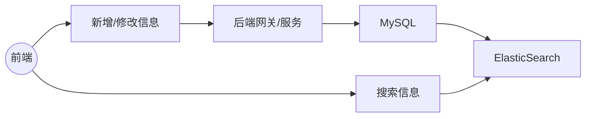

<div align="center">
    <h1>
        项目经验(?)
    </h1>
</div>


这个项目之所以后端坚持上分布式与微服务就是希望能够通过亲自上手的方式来加强记忆，同时提升熟练度。很多坑不自己踩过是永远不会了解的。这篇文档存在的意义就是记录一下遇到的一些问题、


## 1. 分布式事务

周二的时候做到了拼车行程搜索模块，很熟悉的架构



在这层MySQL和ElasticSearch之间就存在着分布式事务的问题。将这整个流程直接写在一个方法线程中显然是不可取的。整个事务会显得非常冗长，前端用户的体验极差。

解决的方法有两种：

+ 我的歪门邪道是因为确实只有两个任务需要同时进行，因此可以同时开两个线程来执行两地的任务。为了保证新开线程的事务一致性，可以另起一个`@Service`，也可以使用获取回调并手动提交的方式。

+ 标准的分布式事务解决方案

  详见学成在线第4章讲义

  


## 2. Jackson序列化Object异常

Jackson在执行`objectMapper.convertValue`操作时报出Cannot construct instance of (although at least one Creator exists)异常

需要为被其转换的类加上如下构造

```java
public LoginAccount(String json) throws IOException {
        LoginAccount loginAccount = new ObjectMapper().readValue(json, LoginAccount.class);
        this.id = loginAccount.getId();
        this.username = loginAccount.getUsername();
        this.password = loginAccount.getPassword();
        this.role = loginAccount.getRole();
        this.isDeleted = loginAccount.getIsDeleted();
}
```

或者 使用 `ObjectMapper.readValue()` 代替 `ObjectMapper.convertValue()` 对JSON数据进行反转

这两个方法的主要区别在于，`readValue`方法需要将JSON字符串作为参数传递，而`convertValue`方法需要将JSON对象作为参数传递。此外，`readValue`方法可以将JSON字符串转换为Java对象的任何类型，而`convertValue`方法只能将JSON对象转换为指定类型的Java对象。

在类出现继承关系时请及时注意框定需要转换的字段范围。需要将父类的字段标记为已排除字段，避免出现构造方法的引用问题。

最终的`LoginAccount`类如下所示

```java
package edu.npu.entity;

import com.fasterxml.jackson.annotation.JsonIgnoreProperties;
import com.fasterxml.jackson.annotation.JsonInclude;
import com.fasterxml.jackson.databind.ObjectMapper;
import edu.npu.common.RoleEnum;
import lombok.AllArgsConstructor;
import lombok.Data;
import lombok.NoArgsConstructor;
import org.springframework.security.core.GrantedAuthority;
import org.springframework.security.core.authority.SimpleGrantedAuthority;
import org.springframework.security.core.userdetails.UserDetails;

import java.io.IOException;
import java.io.Serial;
import java.io.Serializable;
import java.util.Collection;
import java.util.List;
import java.util.Objects;

/**
 * 用于用户名密码登录所需表格
 * @TableName login_account
 */
@Data
@NoArgsConstructor
@AllArgsConstructor
// 排除UserDetails的参数。这些参数不需要被存到Redis中，可以直接通过本类中方法生成
@JsonIgnoreProperties(
        value = {"accountNonExpired", "accountNonLocked",
                "credentialsNonExpired", "enabled", "authorities"})
@JsonInclude(JsonInclude.Include.NON_NULL)
public class LoginAccount implements Serializable, UserDetails {
    /**
     * 用户登录时唯一编号
     */
    private Long id;

    /**
     * 用户登录名/用户手机号
     */
    private String username;

    /**
     * 用户登录密码
     */
    private String password;

    /**
     * 用户角色:司机/乘客,管理员
     */
    private int role;

    /**
     * 逻辑删除字段,0未删除,1已删除
     */
    private Integer isDeleted;

    @Serial
    private static final long serialVersionUID = 184688L;

    @Override
    public Collection<? extends GrantedAuthority> getAuthorities() {
        return List.of(new SimpleGrantedAuthority(
                Objects.requireNonNull(RoleEnum.fromValue(role)).name()));
    }

    @Override
    public boolean isAccountNonExpired() {
        return true;
    }

    @Override
    public boolean isAccountNonLocked() {
        return isDeleted == 0;
    }

    @Override
    public boolean isCredentialsNonExpired() {
        return true;
    }

    @Override
    public boolean isEnabled() {
        return true;
    }

    // 需要手动准备如下构造函数供Jackson调用 否则报Cannot construct instance of
    public LoginAccount(String json) throws IOException{
        LoginAccount loginAccount = new ObjectMapper().readValue(json, LoginAccount.class);
        this.id = loginAccount.getId();
        this.username = loginAccount.getUsername();
        this.password = loginAccount.getPassword();
        this.role = loginAccount.getRole();
        this.isDeleted = loginAccount.getIsDeleted();
    }
}
```


## 3. 价格计算

这次项目中的价格部分确实是进行了简化的。

关于存价格这件事一般有俩解决方案

+ 所有价格都用int存，表示分位，计算时也按照分的逻辑进行运算，如果实在需要按照元的情况进行计算了(如向支付宝发送请求时)再进行转换。我个人认为这种方案是稳妥的，能够规避大量的精度问题。
+ 使用decimal，包括在Java端使用`BigDecimal`，在MySQL端`decimal`类型来存储价格数据。能尽量从数据类型的角度上来规避精度丢失问题。
