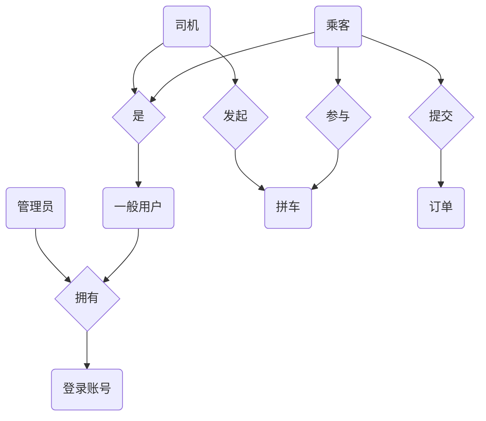
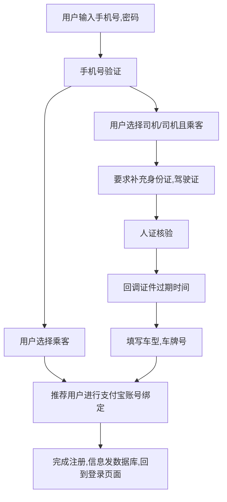
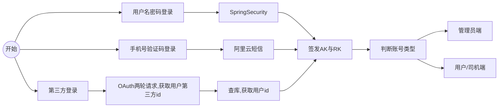
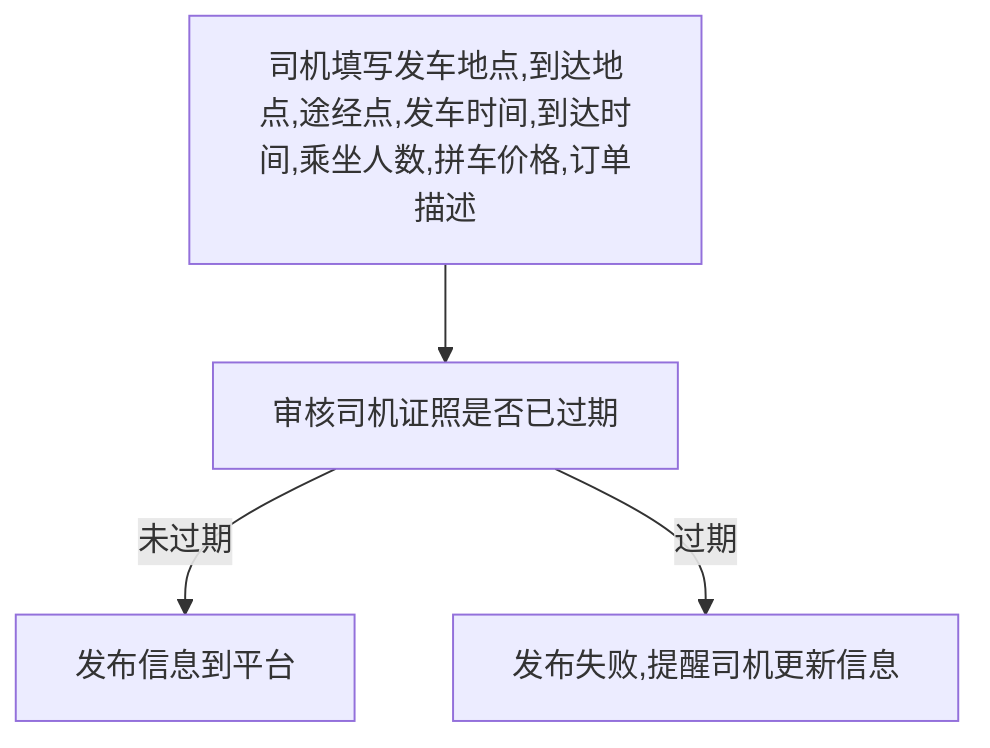
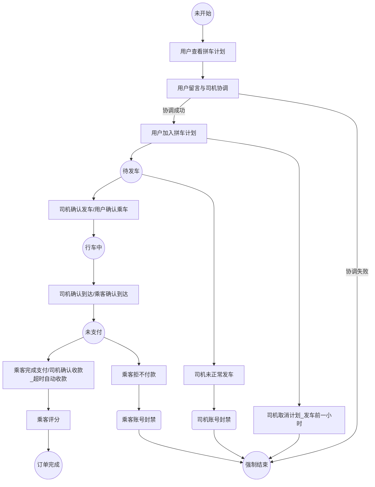

    <h1>
        西工大拼车系统_详细设计
    </h1>
    <h3>
        王旻安 2023.4.10
    </h3>

## 1. 前端

### 1.1 前端技术栈

+ 使用Vue3 + Vite + Vant进行框架搭建
+ 预计将调用阿里云OSS与高德地图导航API来分别实现对象存储与路径规划展示

### 1.2 前端框架

为简单的单体移动端前端应用。

## 2. 后端

### 2.1 后端技术栈

+ SpringBoot 3.0.2, SpringCloud 2022.2, SpringCloud Alibaba 2022.0.0.0-RC1

### 2.2 服务拆分

+ carpooling-parent 总模块，其余所有模块都是下属module，规定依赖版本
+ carpooling-base 基础模块，用于定义Web基础Config，页面返回状态，常量Enum，基础工具，Exception统一处理，只继承parent，无启动类，无需注册。
+ carpooling-gateway 网关模块，需要声明security-config来执行白名单过滤。需要引入JWT鉴权配置，但只做验证不做分发。
+ carpooling-auth security模块。用于完成用户名-密码，手机号-短信，第三方认证登录三项登录请求。同时满足用户管理要求。单体模块不进一步拆分。
+ carpooling-search 数据查询模块。主要负责将数据库中拼车内容引入ES并提供搜索
+ carpooling-carpooling 提供拼车信息的增删改，分体模块，分API-MODEL-SERVICE，注意要完成管理端的数据导出功能
+ carpooling-status 提供订单状态的CRUD，订单预约-司机审核-订单开始-订单结束-完成支付-互相评价API-MODEL-SERVICE
+ carpooling-payment 支付模块 支付宝SDK 单体模块 XXL-JOB完成本来`@Schedule`的操作

### 2.3 关系型数据库规划

我记得阿里巴巴规范说在数据库设计时不应该使用外键，所有要利用外键来实现的级联业务应当使用代码完成。

实体与联系：

#### 2.3.1 login_account

用于用户名密码登录所需表格

| 列名       | 数据类型               | key类型 | 备注                             |
| ---------- | ---------------------- | ------- | -------------------------------- |
| id         | bigint 用户编号        | primary | auto increment 简化mysql构建索引 |
| username   | varchar255 用户手机号  |         | not null, unique                 |
| password   | varchar255 用户密码    |         | not null                         |
| role       | tinyint 用户角色       |         | not null 需要引入Enum            |
| is_deleted | tinyint 账号是否已删除 |         | 逻辑删除字段 0未删除 1已删除     |

#### 2.3.2 admin

管理员表——我现在这个想想好像不是很需要，但姑且留着

#### 2.3.3 user

常规用户表

| 列名         | 数据类型                    | key类型 | 备注                             |
| ------------ | --------------------------- | ------- | -------------------------------- |
| id           | bigint 用户编号             | primary | auto increment 简化mysql构建索引 |
| username     | varchar255 用户手机号       |         | not null, unique                 |
| user_image   | varchar255 用户头像存储地址 |         | not null, default 那张00.png     |
| email        | varchar255 用户邮箱         |         | 用于发送通知邮件                 |
| github_id    | varchar255 github返回id     |         | 用于第三方登录                   |
| alipay_id    | varchar255 alipay返回id     |         | 用于第三方登录与支付             |
| is_driver    | boolean 是否是driver        |         | not null, default false          |
| is_passenger | boolean 是否是passenger     |         | not null, default false          |
| is_deleted   | tinyint 账号是否已删除      |         | 逻辑删除字段 0未删除 1已删除     |

#### 2.3.4 driver

司机表

| 列名               | 数据类型                     | key类型 | 备注                                  |
| ------------------ | ---------------------------- | ------- | ------------------------------------- |
| id                 | bigint 唯一编号              | primary | auto increment 简化mysql构建索引      |
| driver_id          | bigint 司机编号              |         | not null 与user表中的一致             |
| personal_id        | varchar18 司机身份证号       |         | not null, unique                      |
| drivers_license_no | varchar12 司机驾驶证号       |         | not null,unique                       |
| driver_confirmed   | boolean 司机是否完成人证核验 |         | not null, default false               |
| driver_expire_date | datetime 司机证件过期时间    |         | 最早过期的证件时间                    |
| plate_no           | varchar8 车牌号              |         | not null                              |
| vehicle _type      | varchar20 车型               |         | not null                              |
| avg_score          | tinyint 司机评分             |         | 五分制 记得考虑第一次接单是null的情况 |
| is_deleted         | tinyint 账号是否已删除       |         | 逻辑删除字段 0未删除 1已删除          |

#### 2.3.5 carpooling

拼车情况表

| 列名             | 数据类型                        | key类型 | 备注                             |
| ---------------- | ------------------------------- | ------- | -------------------------------- |
| id               | bigint 拼车情况                 | primary | auto increment 简化mysql构建索引 |
| driver_id        | bigint 司机用户编号             |         | not null                         |
| departure_time   | datetime 发车时间               |         | not null                         |
| arrive_time      | datetime 到达时间               |         | not null                         |
| departure_campus | varchar10 出发地点              |         | not null default 长安校区        |
| arrive_campus    | varchar10 到达地点              |         | not null default 友谊校区        |
| passing_point    | varchar255 途经点               |         | JSON数组字符串存储               |
| description      | varchar255 司机对本订单描述     |         |                                  |
| total_passenger  | int 剩余能同时支持的乘客数量    |         | not null default 0               |
| price            | int 单位为元 是的我们不考虑小数 |         | not null, default 0              |

#### 2.3.6 order

拼车订单表

| 列名              | 数据类型                   | key类型 | 备注                             |
| ----------------- | -------------------------- | ------- | -------------------------------- |
| id                | bigint 拼车订单            | primary | auto increment 简化mysql构建索引 |
| carpooling_id     | bigint 拼车情况id          |         | 与carpooling表的id字段对应       |
| passenger_id      | bigint 用户编号            |         |                                  |
| driver_message    | varchar255 司机留言        |         |                                  |
| passenger_message | varchar255 乘客留言        |         |                                  |
| status            | int 订单当前状态           |         | not null default 未支付 Enum     |
| create_time       | datetime 订单时间          |         | not null default                 |
| update_time       | datetime 订单状态更新时间  |         |                                  |
| score             | tinyint 订单完成后用户打分 |         | 五分制                           |

### 2.4 非关系型数据库规划

#### 2.4.1 token

+ AK_RK_EXPIRE

  + key token:{login_account_id}:access, token:{login_account_id}:refresh

    

#### 2.4.2 表彰

+ 月度出车冠军tag
  + key prize:driver:monthly

+ 年度出车冠军tag
  + key prize:driver:yearly

## 3. 业务基本流程

### 3.1 注册

管理员账号由后台给出，不参与注册流程

### 3.2 登录

### 3.3 司机发布拼车信息

### 3.4 订单状态变化

### 3.5 管理端导出

+ 导出一段时期内的全部拼车记录或者某位车主的拼车记录
+ 导出一段时期内按成功的拼车记录数量排序的车主列表

## 4. 补充

### 4.1 中英文对应用词规范

+ 司机 driver
+ 乘客 passenger
+ 拼车 carpooling
+ 订单 order
+ 启程离开 departure
+ 到达 arrive
+ 途经点 passing point
+ 车牌号 plateNo