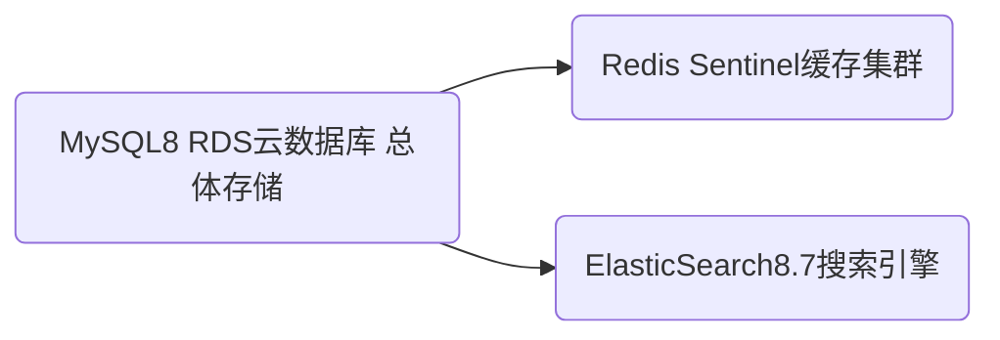

    <h1>
        西工大拼车系统_需求分析
    </h1>
    <h3>
        林昊辰 2023.6.15
    </h3>

需求分析也称为软件需求分析、系统需求分析或需求分析工程等，是开发人员经过深入细致的调研和分析，准确理解用户和项目的功能、性能、可靠性等具体要求，将用户非形式的需求表述转化为完整的需求定义，从而确定系统必须做什么的过程。

 

# 1.引言

## 1.1编写目的

1.需求分析编写的目的是为了全面、清晰地了解西工大拼车系统的需求和功能，确保开发团队和利益相关者对系统的期望和目标达成一致。

2.说明编写本软件说明书的目的

1. 确定系统范围和边界：通过需求分析，明确系统所涉及的功能和用户，定义系统的范围和边界，避免范围蔓延和需求不明确的问题。
2. 识别功能需求：通过需求分析，识别和明确系统的基本功能需求，包括车主发布拼车信息、乘客下单、订单确认等，确保系统能够满足用户的核心需求。
3. 确定非功能需求：需求分析有助于识别和明确系统的非功能需求，如性能、安全性、可用性等方面的要求，确保系统在这些方面的表现符合预期。
4. 理解用户特点和场景：通过需求分析，了解系统的基本涉众，包括有车的车主、需要拼车的人员和管理员，以及系统的应用场景和典型用户行为，从而更好地设计和定制系统。
5. 建立共识和沟通基础：需求分析文档提供了一个详细、准确的描述系统需求的共享资料，帮助开发团队和利益相关者建立共识，并为进一步的开发和沟通提供基础。
6. 风险管理：通过需求分析，可以识别潜在的风险和问题，提前进行风险管理和预防措施，避免项目后期的需求变更和修正。

3.软件开发人员以及未来会用到系统的用户

## 1.2项目背景

 西工大新老校区之间通勤，除了公交车外，还有很多自驾车可以提供拼车。

## 1.3术语说明（必填）

| **序号** | **术语**     | **所指对象或含义**                                           |
| -------- | ------------ | ------------------------------------------------------------ |
| 1        | 车主         | 指拥有车辆并愿意提供拼车服务的用户。车主可以发布可用拼车信息，接受乘客的拼车订单 |
| 2        | 乘客         | 指需要拼车的用户。乘客可以选择合适的车辆发布拼车订单，并与车主协商具体的拼车细节。 |
| 3        | 拼车信息     | 指车主发布的可用拼车信息，包括发车时间、座位数、起止点和行驶路线等。 |
| 4        | 拼车订单     | 指乘客发布的拼车请求，包括选择的车辆、发车时间微调、中途下车位置等信息。 |
| 5        | 确认拼车     | 指车主对乘客的拼车订单进行确认，表示同意提供拼车服务。       |
| 6        | 座位数       | 指车主可提供的拼车座位数量，用于乘客选择合适的车辆进行拼车。 |
| 7        | 发车时间     | 指乘客在拼车订单中请求对发车时间进行微小调整，以适应个人需求。 |
| 8        | 中途下车位置 | 指乘客在拼车订单中请求在指定位置中途下车，而不必到达目的地。 |
| 9        | 管理员       | 指拼车系统的管理者，负责系统的运行、监控和维护。管理员可以导出拼车记录和车主列表等信息。 |
| 10       | 拼车记录     | 指系统记录的拼车信息，包括车主发布的拼车信息和乘客的拼车订单等。 |

## 1.4参考资料

无

# 2.任务概述

## 2.1待开发软件的一般描述

​		西工大拼车系统旨在为西工大校园内的师生提供便捷的拼车服务，通过车主和乘客之间的配对，实现校园内的交通共享和减少汽车单独行驶，从而减少交通拥堵和环境污染。

 

## 2.2用户特征

西工大师生，或一般学历司机

## 2.3运行环境

4核8g服务器

# 3.数据描述

## 3.1静态数据

系统中保持不变的数据。

| 数据名称       | 数据类型 | 数据说明                                              |
| :------------- | -------- | ----------------------------------------------------- |
| 用户数据：     | 数据结构 | 用户ID 用户名 密码 姓名 手机号码 邮箱地址             |
| 车辆数据：     | 数据结构 | 车主ID 车牌号 车型 座位数                             |
| 拼车信息数据： | 数据结构 | 车主ID 发车时间 起始地点 目的地点 行驶路线 可用座位数 |
| 拼车订单数据： | 数据结构 | 订单ID 车主ID 乘客ID 发车时间 中途下车位置 备注信息   |
| 管理员数据：   | 数据结构 | 管理员ID 管理员用户名 密码                            |
| 系统配置数据： | 数据结构 | 最大座位数限制 拼车时间间隔限制 拼车费用规则          |

## 3.2动态数据

包括输入数据和输出数据

| 数据名称         | 数据类型 | 数据说明                                                     |
| ---------------- | -------- | ------------------------------------------------------------ |
| 用户活动数据：   | 数据结构 | 用户登录日志：记录用户的登录时间、IP地址等信息。 用户操作日志：记录用户的操作行为，如发布拼车信息、下单、确认订单等。 |
| 拼车记录数据：   | 数据结构 | 拼车成功记录：记录每次成功的拼车订单，包括车主和乘客的信息、拼车时间、起止地点等。 拼车失败记录：记录未能成功匹配的拼车订单，包括车主和乘客的信息、拼车时间、起止地点等。 |
| 评价和反馈数据： | 数据结构 | 乘客评价：记录乘客对拼车服务和车主的评价，包括评分和文字评论。 车主评价：记录车主对乘客的评价，包括评分和文字评论。 用户反馈：记录用户对系统的意见、建议和问题反馈。 |
| 统计数据：       | 数据结构 | 拼车次数统计：统计每位车主的拼车次数，用于表彰和奖励。 用户活跃度统计：统计用户的活跃度和使用频率。 拼车成功率统计：统计拼车订单的成功率，用于评估系统的效果和改进。 |

## 3.3内部生成数据

1. 拼车路线规划数据：
   - 路线距离和预计时间：系统根据起始地点和目的地点之间的距离和交通状况，生成预计的行驶时间和路线规划。
2. 拼车匹配数据：
   - 匹配算法结果：系统根据车主和乘客的拼车需求和条件，使用匹配算法生成匹配结果，确定最佳的拼车配对。
3. 拼车费用计算数据：
   - 费用计算规则：系统根据设定的拼车费用规则和计费方式，自动生成拼车费用的计算结果。
4. 用户活跃度数据：
   - 活跃度评估指标：系统根据用户的登录频率、发布拼车信息的频率和下单的次数等，生成用户的活跃度评估指标，用于统计和分析。
5. 系统通知和提醒数据：
   - 提醒消息：系统根据用户的拼车订单状态、发车时间等信息，自动生成提醒消息，通知用户订单状态变更或需要注意的事项。
6. 统计报表数据：
   - 拼车次数统计报表：系统根据拼车记录和订单数据，自动生成车主的拼车次数统计报表，用于表彰和奖励。
   - 拼车成功率报表：系统根据拼车记录和订单数据，自动生成拼车成功率统计报表，用于评估系统的效果和改进。

## 3.4业务功能模块数据流图（必填）

抱歉，作为一个文本交互模型，我无法为您提供图形化的数据流图。然而，我可以为您提供一个基于文本的业务功能模块描述，来帮助您理解西工大拼车系统的数据流。

以下是西工大拼车系统的一些业务功能模块和数据流的描述：

1. 用户管理模块：
   - 用户注册：用户通过提供必要的个人信息和凭据，完成系统的注册流程。输入数据：用户名、密码、手机号码、邮箱地址。输出数据：注册成功信息。
   - 用户登录：已注册的用户通过提供正确的凭据，登录到系统。输入数据：用户名、密码。输出数据：登录成功信息。
2. 车主功能模块：
   - 发布拼车信息：车主发布可用的拼车信息，包括发车时间、座位数、起止点和行驶路线等。输入数据：拼车信息。输出数据：发布成功信息。
   - 确认拼车订单：车主查看乘客的拼车订单，并确认是否同意该订单。输入数据：拼车订单信息。输出数据：订单确认结果。
3. 乘客功能模块：
   - 搜索可用拼车信息：乘客根据自己的需求，搜索系统中可用的拼车信息。输入数据：搜索条件。输出数据：匹配的拼车信息列表。
   - 创建拼车订单：乘客选择合适的车辆，并创建拼车订单，提供发车时间、中途下车位置等信息。输入数据：拼车订单信息。输出数据：订单创建成功信息。
4. 管理员功能模块：
   - 数据统计与报表生成：管理员根据需求，导出一段时期内的全部拼车记录、某位车主的拼车记录，以及按成功的拼车记录数量排序的车主列表。输入数据：统计条件。输出数据：统计报表。
5. 系统通知模块：
   - 发送提醒消息：系统根据用户的拼车订单状态、发车时间等信息，向相关用户发送提醒消息。输入数据：提醒消息内容。输出数据：发送成功信息。

sentinel集群详见 [经验总结](./经验总结.md)

## 3.5数据词典（必填）

1. 用户（User）
   - 用户ID（ID）: 唯一标识用户的ID
   - 用户名（Username）: 用户的用户名
   - 密码（Password）: 用户的密码
   - 姓名（Name）: 用户的真实姓名
   - 手机号码（Phone）: 用户的手机号码
   - 邮箱地址（Email）: 用户的邮箱地址
2. 车辆（Vehicle）
   - 车主ID（OwnerID）: 车辆所有者的ID
   - 车牌号（LicensePlate）: 车辆的车牌号
   - 车型（Model）: 车辆的型号
   - 座位数（SeatCount）: 车辆的座位数
3. 拼车信息（CarpoolInfo）
   - 车主ID（OwnerID）: 拼车信息发布者的ID
   - 发车时间（DepartureTime）: 拼车的发车时间
   - 起始地点（StartLocation）: 拼车的起始地点
   - 目的地点（Destination）: 拼车的目的地点
   - 行驶路线（Route）: 拼车的行驶路线
   - 可用座位数（AvailableSeats）: 拼车中还可用的座位数
4. 拼车订单（CarpoolOrder）
   - 订单ID（OrderID）: 拼车订单的唯一ID
   - 车主ID（OwnerID）: 拼车订单对应的车主的ID
   - 乘客ID（PassengerID）: 拼车订单对应的乘客的ID
   - 发车时间（DepartureTime）: 拼车的发车时间
   - 中途下车位置（DropOffLocation）: 乘客希望下车的位置
   - 备注信息（Note）: 拼车订单的备注信息
5. 管理员（Admin）
   - 管理员ID（ID）: 唯一标识管理员的ID
   - 管理员用户名（Username）: 管理员的用户名
   - 密码（Password）: 管理员的密码

# 4.功能需求（必填）

列举出所开发的软件能实现的全部功能，可采用文字、图表或数学公式等多种方法进行描述。

# 5.性能需求（必填）

## 5.1并发性

- 系统应支持多个用户同时进行拼车信息发布、订单创建和确认等操作，以满足高并发需求。
- 系统的并发处理能力应支持至少200个同时进行的拼车相关操作。
- 系统在高并发情况下，应保持稳定性和响应性能，不应出现严重的延迟或阻塞现象。

## 5.2容错要求

- 系统应具备容错机制，能够处理异常情况和错误输入，保证系统的稳定运行。
- 在面对异常情况或系统故障时，系统应能够及时恢复，并提供适当的错误提示或告警信息。
- 数据的持久性和一致性应得到保障，即使在系统故障或意外断电的情况下，数据不应丢失或损坏。

## 5.3时间特性

- 系统应具备快速响应的特性，能够在短时间内处理用户的请求并提供即时的结果。
- 用户登录、注册等基本操作的响应时间应在2秒以内。
- 搜索可用拼车信息、创建拼车订单等操作的响应时间应在3秒以内。

## 5.4适应性

- 系统应具备良好的适应性，能够应对不同规模的用户和数据量的变化。
- 系统的性能应能够自动调整和优化，以适应日益增长的用户数量和数据规模。
- 在系统扩展或升级时，应能够无缝迁移和平滑过渡，避免对用户造成不必要的中断或影响。

 

# 6.软件属性需求

## 6.1正确性

- 系统应能够准确执行所需的功能，符合用户的期望和需求。
- 系统的逻辑和算法应正确无误，能够产生正确的结果。
- 系统应能够有效处理各种边界情况和异常输入，避免产生错误或异常行为。

## 6.2可靠性

- 系统应具备高度的可靠性，能够在长时间运行中保持稳定性。
- 系统的故障率应尽可能低，能够自动处理或恢复出现的错误和故障。
- 系统应能够保护用户数据的安全性和完整性，避免数据丢失或损坏。

## 6.3效率

- 系统应具备高效的性能，能够在合理的时间内完成各项操作。
- 系统的响应时间应快速，用户操作不应有明显的延迟或卡顿现象。
- 系统应有效利用计算和存储资源，以提高整体的运行效率。

## 6.4完整性

- 系统应具备完整的功能覆盖，能够满足用户的各项需求。
- 所有必要的功能模块和操作流程应得到正确实现和完善。
- 系统应能够处理各种常见的使用场景和用户需求，不应缺少重要功能或信息。

## 6.5易使用性

- 系统应具备良好的用户界面设计，易于使用和操作。
- 用户操作流程应简单明了，指导和帮助信息应清晰可见。
- 系统应提供友好的用户反馈，及时提示操作结果和错误信息。

## 6.6可维护性

- 系统应具备良好的可维护性，方便后续的系统更新和维护工作。
- 系统的代码应具备良好的结构和可读性，易于理解和修改。
- 系统应提供必要的文档和注释，方便开发人员进行代码维护和升级。

## 6.7可测试性

- 系统应具备良好的可测试性，方便进行系统的单元测试和集成测试。
- 系统的各个功能模块应能够独立测试，确保其正确性和稳定性。
- 系统应提供必要的测试工具和环境，方便开发人员进行测试工作。

 

## 6.8复用性

- 系统应具备良好的复用性，能够重复利用已有的组件和功能模块。
- 系统的设计和实现应考虑到组件的可重用性，以提高开发效率和代码的可维护性。
- 常用的功能模块和算法应抽象成可复用的库或组件，方便在不同场景下进行重复利用。

## 6.9安全保密性

- 系统应具备高度的安全性和保密性，确保用户的个人信息和交易数据得到保护。
- 用户的登录和注册信息应进行加密存储，并采取适当的安全措施防止未经授权的访问。
- 交易数据的传输应采用安全的加密通信协议，防止数据泄露和篡改的风险。

## 6.10可理解性

- 系统的设计和实现应具备良好的可理解性，易于开发人员理解和维护。
- 代码应具备良好的结构和命名规范，以提高代码的可读性和可理解性。
- 系统的文档和注释应清晰明了，方便开发人员和维护人员理解系统的功能和实现细节。

## 6.11可移植性

- 系统应具备良好的可移植性，能够在不同的操作系统和硬件平台上运行。
- 系统的设计和实现应遵循标准化的技术规范，减少对特定平台的依赖性。
- 关键的系统依赖应进行适配或抽象，以提高系统的可移植性和兼容性。

## 6.12互联性

- 系统应具备良好的互联性，能够与其他系统或服务进行集成和交互。
- 系统的接口应遵循通用的标准或协议，以便与外部系统进行数据交换和通信。
- 系统应提供必要的接口文档和开发工具，以促进与第三方系统的集成和互操作。

 

# 7.其他需求（非必须）

1. 数据分析和报告：
   - 系统可以提供数据分析和报告的功能，对拼车记录和用户行为进行统计和分析。
   - 系统可以生成拼车趋势、用户偏好等报告，以便管理人员进行决策和优化。
2. 智能化（Intelligence）：
   - 系统可以引入智能算法和技术，提供个性化的推荐和优化策略。
   - 系统可以利用数据分析和机器学习等技术，实现拼车匹配和路线规划的智能化功能。
3. 用户反馈和评价：
   - 系统应提供用户反馈和评价的功能，用户可以对拼车服务和车主进行评分和评论。
   - 系统可以根据用户反馈和评价进行数据分析，提供有关车主信誉和服务质量的参考。
4. 实时信息和通知：
   - 系统可以提供实时的拼车信息和车辆位置，方便用户选择合适的拼车车辆。
   - 系统可以通过短信、推送通知等方式向用户发送拼车相关的提醒和通知。

# 8.附录

## 8.1尚未解决的问题（可选）

无

## 8.2注解（可选）

无

 